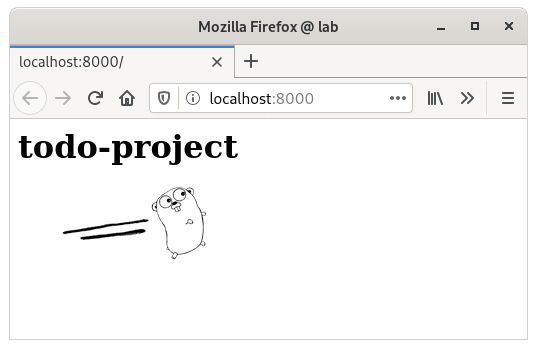

# todo-project

[https://github.com/pasiol/todo-project/tree/1.05]

Exercise 1.05

    pasiol@lab:~$ kubectl get pods
    NAME                            READY   STATUS    RESTARTS   AGE
    log-output-6cb768654c-tnnw5     1/1     Running   1          21h
    todo-project-86bd654c5c-wtcld   1/1     Running   1          21h
    pasiol@lab:~$ kubectl logs todo-project-86bd654c5c-wtcld
    2021/11/04 12:55:27 Server started in port 8000
    pasiol@lab:~$ kubectl port-forward todo-project-86bd654c5c-wtcld 8000:8000
    Forwarding from 127.0.0.1:8000 -> 8000
    Forwarding from [::1]:8000 -> 8000
    
    Handling connection for 8000

