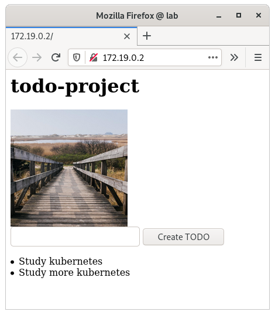

# todo-project

[https://github.com/pasiol/todo-project/tree/1.13]

Exercise 1.13

    pasiol@lab:~$ kubectl apply -f https://raw.githubusercontent.com/pasiol/todo-project/1.13/manifests/deployment.yaml
    deployment.apps/todo-project configured
    pasiol@lab:~$ kubectl get pods
    NAME                            READY   STATUS    RESTARTS   AGE
    todo-project-5c6d8bd4d4-ltnjs   1/1     Running   0          15s
    pasiol@lab:~$ kubectl logs todo-project-5c6d8bd4d4-ltnjs
    2021/11/08 21:15:11 server started in port 3000
    2021/11/08 21:15:11 daily image timestamp is less than 24 hours old
    pasiol@lab:~$ kubectl get ing
    NAME                   CLASS    HOSTS   ADDRESS                            PORTS   AGE
    todo-project-ingress   <none>   *       172.19.0.2,172.19.0.4,172.19.0.5   80      34m

