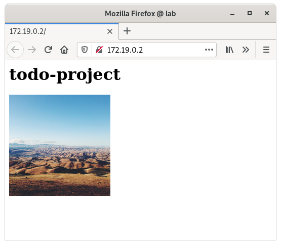

# todo-project

[https://github.com/pasiol/todo-project/tree/1.12]

Exercise 1.12

    pasiol@lab:~$ kubectl apply -f https://raw.githubusercontent.com/pasiol/todo-project/1.12/manifests/persistentVolume.yaml
    persistentvolume/todo-project-pv created
    pasiol@lab:~$ kubectl apply -f https://raw.githubusercontent.com/pasiol/todo-project/1.12/manifests/persistentVolumeClaim.yaml
    persistentvolumeclaim/todo-project-claim created
    pasiol@lab:~$ kubectl apply -f https://raw.githubusercontent.com/pasiol/todo-project/1.12/manifests/deployment.yaml
    deployment.apps/todo-project created
    pasiol@lab:~$ kubectl apply -f https://raw.githubusercontent.com/pasiol/todo-project/1.12/manifests/service.yaml
    service/todo-project-svc created
    pasiol@lab:~$ kubectl apply -f https://raw.githubusercontent.com/pasiol/todo-project/1.12/manifests/ingress.yaml
    ingress.networking.k8s.io/todo-project-ingress created
    pasiol@lab:~$ kubectl get pods
    NAME                            READY   STATUS    RESTARTS   AGE
    todo-project-744b58d489-vbjzs   1/1     Running   0          9s
    pasiol@lab:~$ kubectl logs todo-project-744b58d489-vbjzs
    2021/11/08 20:43:15 server started in port 3000
    2021/11/08 20:43:16 daily image getting statuscode 200
    2021/11/08 20:43:16 updated daily image succesfully

    pasiol@lab:~$ kubectl delete -f https://raw.githubusercontent.com/pasiol/todo-project/1.12/manifests/deployment.yaml
    deployment.apps "todo-project" deleted
    pasiol@lab:~$ kubectl apply -f https://raw.githubusercontent.com/pasiol/todo-project/1.12/manifests/deployment.yaml
    deployment.apps/todo-project created
    pasiol@lab:~$ kubectl get pods
    NAME                            READY   STATUS    RESTARTS   AGE
    todo-project-744b58d489-v5j78   1/1     Running   0          6s
    pasiol@lab:~$ kubectl logs todo-project-744b58d489-v5j78
    2021/11/08 20:44:37 server started in port 3000
    2021/11/08 20:44:37 daily image timestamp is less than 24 hours old

    pasiol@lab:~$ kubectl get ing
    NAME                   CLASS    HOSTS   ADDRESS                            PORTS   AGE
    todo-project-ingress   <none>   *       172.19.0.2,172.19.0.4,172.19.0.5   80      4m48s

